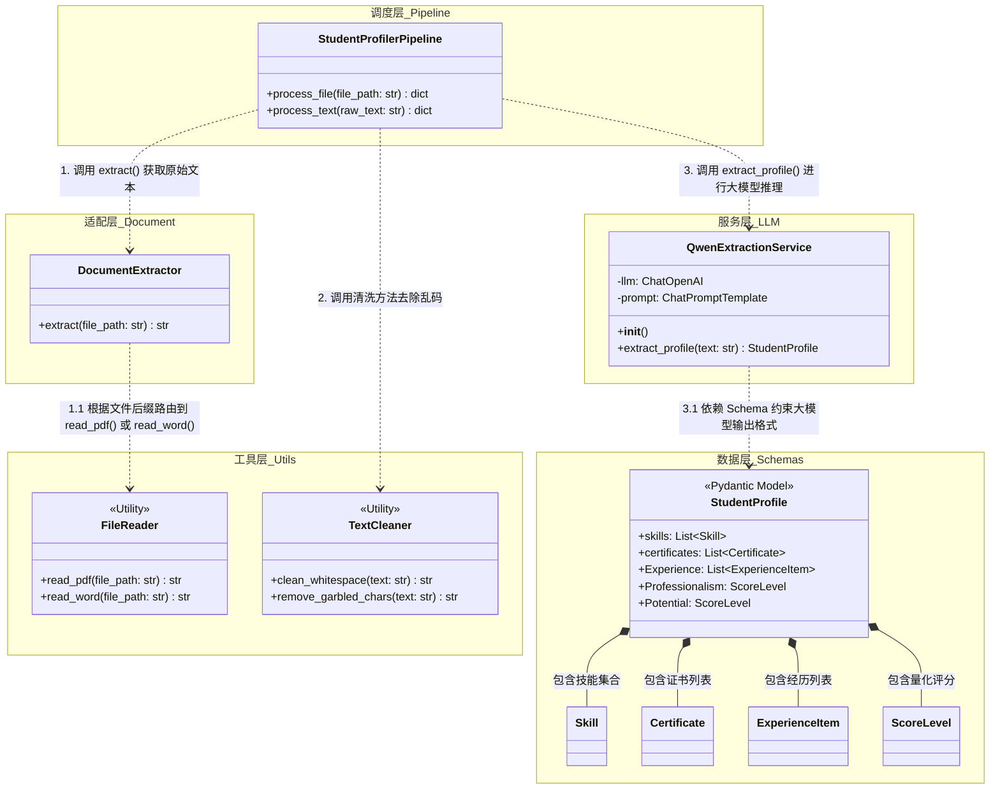

## 学生能力建模模块 (Student Profiling) 详细实现文档

### 1. 模块、类及调用依赖关系

整个模块采用经典的控制流管道（Pipeline）设计，分为核心调度层、大模型服务层、数据模型层和工具层。

-   **`StudentProfilerPipeline` (核心调度类)**
    
    -   **职责**：负责串联整个业务流，从接收文件/文本到输出结构化 JSON。
        
    -   **主要方法**：
        
        -   `process_file(file_path: str) -> dict`: 接收 PDF/Word 文件路径，调用 `utils` 读取文本，然后传递给 LLM 服务提取，最后返回标准化字典。
            
        -   `process_text(raw_text: str) -> dict`: 直接处理用户录入的非结构化文本。
            
    -   **依赖**：依赖 `DocumentExtractor` 和 `QwenExtractionService`。
        
-   **`QwenExtractionService` (大模型抽取服务类)**
    
    -   **职责**：封装 LangChain 与大模型（推荐使用 Qwen 系列，其 JSON 指令遵循能力极佳）的交互逻辑，强制输出固定 Schema。
        
    -   **主要方法**：
        
        -   `__init__()`: 初始化 `ChatOpenAI` 客户端（配置 Qwen 的 base_url 和 API Key），并加载 Prompt 模板。
            
        -   `extract_profile(text: str) -> StudentProfile`: 核心方法。利用 LangChain 的 `with_structured_output` 绑定 Pydantic 模型，调用大模型并解析结果。
            
    -   **依赖**：依赖 Pydantic 定义的 `StudentProfile` Schema 类。
        
-   **`DocumentExtractor` (文档提取适配器)**
    
    -   **职责**：统一不同格式文档的读取接口。
        
    -   **主要方法**：
        
        -   `extract(file_path: str) -> str`: 根据文件后缀自动路由到具体的解析工具类。
            

### 2. 工具类 (Utils)

在项目目录下建立 `utils/` 文件夹，存放无状态的纯函数工具，确保主流程代码清晰。

-   **`file_reader.py` (文件读取工具)**
    
    -   `read_pdf(file_path: str) -> str`: 使用 `PyMuPDF` (fitz) 遍历 PDF 每一页，提取文本并拼接。
        
    -   `read_word(file_path: str) -> str`: 使用 `python-docx` 读取段落文本（作为 `docx2txt` 的替代方案，支持更细粒度的控制）。
        
-   **`text_cleaner.py` (文本清洗工具)**
    
    -   `clean_whitespace(text: str) -> str`: 去除多余的空格、换行符和不可见字符。
        
    -   `remove_garbled_chars(text: str) -> str`: 通过正则表达式剔除常见的乱码字符，防止干扰 LLM 抽取。
        

### 3. 环境与依赖配置

在 PyCharm 的终端中激活你的虚拟环境，安装以下核心依赖。LangChain 生态已拆分，我们需要精准引入：

Bash

```
# 核心业务框架
pip install langchain langchain-core

# 如果使用 Qwen 等兼容 OpenAI 接口的模型，使用 openai 的集成包最稳定
pip install langchain-openai 

# 数据结构约束与验证 (LangChain 深度依赖)
pip install pydantic

# 文档处理工具
pip install pymupdf python-docx

```

### 4. 接口规范与 JSON Schema 约束实现

为了让大模型“严格遵守结构”且“无对应信息填充合理默认值”，我们必须利用 Pydantic 定义严密的 Python 类。LangChain 会自动将这些类转换为 JSON Schema 喂给大模型。

在 `schemas.py` 中定义以下规范：

Python

```
from pydantic import BaseModel, Field
from typing import List, Optional

class Skill(BaseModel):
    name: str = Field(..., description="技能名称，例如：SpringBoot, MySQL")
    level: int = Field(default=1, ge=1, le=5, description="熟练度评分，范围1~5，1=入门，5=精通")
    evidence: str = Field(default="", description="简历中支撑该技能的原文，精准截取")

class Certificate(BaseModel):
    name: str = Field(..., description="证书名称，例如：英语六级")
    evidence: str = Field(default="", description="简历中支撑该证书的原文，精准截取")

class ExperienceItem(BaseModel):
    name: str = Field(..., description="项目或者实习经历的名称")
    evidence: str = Field(default="", description="简历中支撑该经历的原文描述")

class ScoreLevel(BaseModel):
    level: int = Field(default=1, ge=1, le=5, description="评分，范围1~5")

class StudentProfile(BaseModel):
    """提取的学生简历结构化信息"""
    skills: List[Skill] = Field(default_factory=list, description="提取学生技能和熟练度评分")
    certificates: List[Certificate] = Field(default_factory=list, description="提取学生相关证书")
    Experience: List[ExperienceItem] = Field(default_factory=list, description="提取项目经历与实习经历信息")
    Professionalism: ScoreLevel = Field(default_factory=lambda: ScoreLevel(level=1), description="根据简历的信息判断职业素养评分，范围1~5")
    Potential: ScoreLevel = Field(default_factory=lambda: ScoreLevel(level=1), description="根据简历信息判断发展潜力评分，范围1~5")

```

**Schema 约束原理**：

-   `default_factory=list` 确保了如果简历中没有相关信息，输出的是空数组 `[]` 而不是报错或缺少字段。
    
-   `ge=1, le=5` 在代码层面和 Schema 层面双重限制了评分范围。
    
-   在 LangChain 的 Pipeline 中，只需调用 `llm.with_structured_output(StudentProfile)`，框架就会自动处理底层复杂的 JSON 解析、重试机制和类型验证。
    
